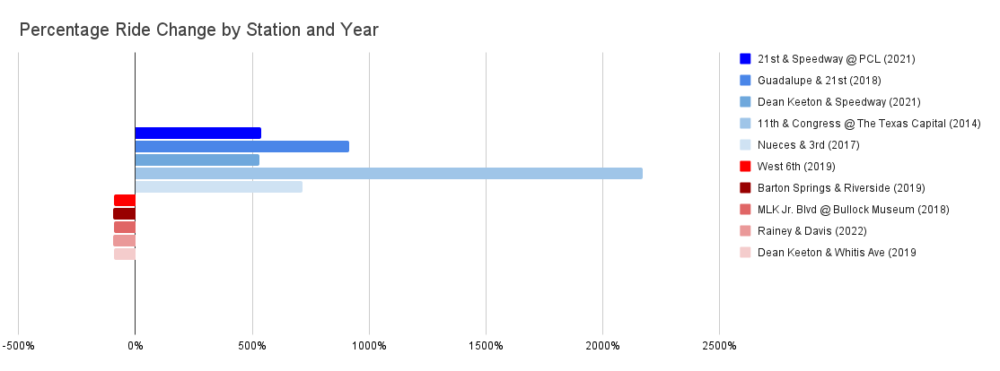

# Introduction
The City of Austin — through joint ownership with CapMetro — provides 24/7 public access to a fleet of 100% electric-assist bikes, modern docking stations, and a user-friendly app.

As the City of Austin evaluates upcoming budgetary decisions for its bikeshare program, data-driven insights are essential for guiding resource allocation, staffing, and infrastructure planning. Two key questions frame this analysis:

**When and where is demand highest?**

Understanding peak usage patterns by station, hour, and day type (weekday vs. weekend) helps ensure adequate bike availability and staffing — minimizing wait times, avoiding empty docks, and enhancing the rider experience.

**When and where has ridership changed most significantly over time?**

Analyzing year-over-year station-level trends reveals where ridership has grown or declined, informing long-term decisions around expansion, consolidation, and investment.

# Business Task
In this context, the analytics team has been tasked with addressing the following questions:

- *Which stations in the most recent full year of recorded activity were the busiest, and when, based on weekday vs. weekend patterns?*
- *Year over year, which stations have experienced the most significant ridership growth or decline?*

## Part I: Identifying peak usage times by station and day type

To help the City of Austin optimize operations and rider experience, we will analyze 2023 peak bikeshare traffic by station, hour, and day type. We will idntify the single busiest hour at each station, separately for weekdays and weekends, and then spotlight the top five busiest combinations citywide.

### Query 1: Most popular stations (2023)
```sql
/* Adjust station names to reduce duplicates from formatting variations.
   Clean the raw data by filtering out unrealistically short or long rides.
   Filter to include only rides from the year 2023 to reflect the most recent full year of activity.
   Extract dates and times into new columns. */
WITH cleaned_trips AS(
  SELECT
   REGEXP_REPLACE(LOWER(start_station_name), '[^a-z0-9]', '') AS standardized_start_station,
   EXTRACT(DAYOFWEEK FROM start_time) AS day_of_week,
   EXTRACT(HOUR FROM start_time) AS hour_of_day,
   duration_minutes
   FROM `bigquery-public-data.austin_bikeshare.bikeshare_trips`
WHERE 
  duration_minutes BETWEEN 1 AND 180
  AND EXTRACT(YEAR FROM start_time) = 2023
),

-- Add a new column day_type that categorizes each trip as either a Weekday or Weekend based on day_of_week.
classified_days AS(
  SELECT
    *,
    CASE
     WHEN day_of_week BETWEEN 2 AND 6 THEN 'Weekday'
     ELSE 'Weekend'
    END AS day_type
  FROM cleaned_trips
),

/* Group rides by station, day type, and hour.
   Count how many rides started at each station during a specific hour and day type. */
hourly_rides AS (
  SELECT
    standardized_start_station,
    day_type,
    hour_of_day,
    COUNT(*) AS ride_count
  FROM classified_days
  GROUP BY standardized_start_station, day_type, hour_of_day
),

/* Rank each hour for each station and day type by how many rides occurred.
   Enable the subsequent section to keep only the top rank for each pair. */
peak_hour_ranked AS(
  SELECT
    standardized_start_station,
    day_type,
    hour_of_day AS peak_hour,
    ride_count,
    RANK() OVER(
      PARTITION BY standardized_start_station, day_type
      ORDER BY ride_count DESC
    ) AS rank
  FROM hourly_rides
)

/* Assign rank 1 to the busiest hour at each station, separately for weekdays and weekends.
   Return the busiest hour for each station on weekdays and weekends.
   Limit output to the top 5 busiest combinations. */
SELECT
standardized_start_station,
day_type,
peak_hour,
ride_count
FROM peak_hour_ranked
WHERE rank = 1
ORDER BY ride_count DESC
LIMIT 5;
```
#### Query Results

| Row | standardized_start_station | day_type | peak_hour | ride_count |
|-----|----------------------------|----------|-----------|------------|
| 1   | 21stspeedwaypcl            | Weekday  | 18        | 2081       |
| 2   | deankeetonspeedway         | Weekday  | 15        | 1645       |
| 3   | 28thriogrande              | Weekday  | 18        | 914        |
| 4   | deankeeonwhitis            | Weekday  | 12        | 791        |
| 5   | 21stguadalupe              | Weekday  | 18        | 735        |

#### Key Findings

- 21st & Speedway is the most active station, peaking at 6:00 PM on weekdays with over 2,000 rides during that hour alone in 2023.
- Dean Keeton & Speedway appears second, peaking at 3:00 PM on weekdays.
- West 28th & Rio Grande ranks third, peaking at 6:00 PM on weekdays.
- Dean Keeton & Whitis Avenue emerges fourth, peaking at 12:00 PM on weekdays.
- 21st & Guadalupe also appears in the top five on weekdays, peaking at 5:00 PM.
- Three of the top five stations — 21st & Speedway, Dean Keeton & Speedway, and Dean Keeton & Whitis — form a tight triangle within roughly half a mile of one another, clustered around The University of Texas at Austin, suggesting high weekday afternoon demand among students and/or faculty.

#### Business Insight

These patterns suggest that **resource allocation — such as bike availability, docking capacity, and maintenance staff — should be concentrated during weekday afternoon hours. Stations near UT Austin should be prioritized** to meet the significant demand.

## Part II: Identifying long-term trends by station

To identify long-term performance trends and detect significant ridership increases and declines (that might signal high demand and greater resource allocation opportunities or undersuse/obsolescence), we will calculate the year-over-year (YoY) change in total rides expressed in both absolute ride volume and percentage change. These calculations will identify which stations have experienced the most significant growth or decline, helping city planners make data-informed investment decisions.

### Query 2: Year-over-year changes
```sql
-- Filter out stations with fewer than 10 rides (in the current year) to reduce noise from test data, errors, or short-lived stations.
WITH station_totals AS(
  SELECT
    REGEXP_REPLACE(LOWER(start_station_name), '[^a-z0-9]', '') AS standardized_start_station,
    COUNT(*) AS total_rides
  FROM `bigquery-public-data.austin_bikeshare.bikeshare_trips`
  GROUP BY standardized_start_station
  HAVING COUNT(*) >= 10
),

/* Adjust station names to reduce duplicates from formatting variations.
   Calculate total rides per station per year. */
yearly_ridership AS(
  SELECT
    REGEXP_REPLACE(LOWER(start_station_name), '[^a-z0-9]', '') AS standardized_start_station,
    EXTRACT(YEAR FROM start_time) AS year,
    COUNT(*) AS total_rides
FROM `bigquery-public-data.austin_bikeshare.bikeshare_trips`
GROUP BY standardized_start_station, year
HAVING standardized_start_station IN(
  SELECT standardized_start_station FROM station_totals
)
),

-- Calculate year-over-year growth and percentage change per station.
yearly_ridership_with_growth AS(
  SELECT
  standardized_start_station,
  year,
  total_rides,
  -- Absolute growth in rides compared to previous year.
  total_rides - LAG(total_rides) OVER(
    PARTITION BY standardized_start_station ORDER BY year
  ) AS YoY_absolute_change,
  -- Percentage growth, using SAFE_DIVIDE to avoid dividing by zero.
  SAFE_DIVIDE(
    total_rides - LAG(total_rides) OVER(
    PARTITION BY standardized_start_station ORDER BY year
  ),
  LAG(total_rides) OVER(
      PARTITION BY standardized_start_station ORDER BY year
    )
  ) * 100 AS YoY_pct_change
FROM yearly_ridership
),

--Filter out stations where previous year's total rides are below 200 to reduce noise from brand new stations.
filtered_yearly_ridership AS(
  SELECT
    yr.standardized_start_station,
    yr.year,
    yr.total_rides,
    yr.YoY_absolute_change,
    yr.YoY_pct_change
  FROM yearly_ridership_with_growth yr
  JOIN yearly_ridership prev_yr
    ON yr.standardized_start_station = prev_yr.standardized_start_station
    AND yr.year = prev_yr.year + 1
  WHERE prev_yr.total_rides > 200
),

-- Identify station-year pairs with the largest growth or in ridership.
top_5_growth AS (
  SELECT
    standardized_start_station,
    year,
    total_rides,
    YoY_absolute_change,
    ROUND(YoY_pct_change, 2) AS YoY_pct_change
  FROM filtered_yearly_ridership
  WHERE YoY_absolute_change IS NOT NULL
  ORDER BY YoY_pct_change DESC
  LIMIT 5
),

-- Identify station-year pairs with the largest growth or in ridership.
bottom_5_decline AS (
    SELECT
    standardized_start_station,
    year,
    total_rides,
    YoY_absolute_change,
    ROUND(YoY_pct_change, 2) AS YoY_pct_change
  FROM filtered_yearly_ridership
  WHERE YoY_absolute_change < 0
  ORDER BY YoY_pct_change ASC
  LIMIT 5
)

/* Combine both top 5 and bottom 5 into one set of results.
   Add a direction column to clarify growth or decline. */
SELECT
  standardized_start_station,
  year,
  total_rides,
  YoY_absolute_change,
  YoY_pct_change,
  'growth' AS direction
FROM top_5_growth
UNION ALL
SELECT
  standardized_start_station,
  year,
  total_rides,
  YoY_absolute_change,
  YoY_pct_change,
  'decline' AS direction
FROM bottom_5_decline;
```
#### Query Results

| Row | standardized_start_station | year | total_rides | YoY_absolute_change | YoY_pct_change    | direction |
|-----|----------------------------|------|-------------|---------------------|-------------------|-----------|
| 1   | bartonspringsriverside     | 2019 | 75          | -2263               | -96.79            | decline   |
| 2   | raineydavis                | 2022 | 142         | -2857               | -95.27            | decline   |
| 3   | bullockmuseumcongressmlk   | 2018 | 167         | -2351               | -93.37            | decline   |
| 4   | deankeetonwhitis           | 2019 | 1356        | -15541              | -91.97            | decline   |
| 5   | west6thst                  | 2019 | 137         | -1531               | -91.79            | decline   |
| 6   | 11thcongressthetexascapitol| 2014 | 5632        | 5384                | 2170.97           | growth    |        
| 7   | guadalupe21st              | 2018 | 15530       | 13998               | 913.71            | growth    |  
| 8   | nueces3rd                  | 2017 | 3625        | 3181                | 716.44            | growth    |  
| 9   | 21stspeedwaypcl            | 2021 | 17665       | 14894               | 537.5             | growth    |  
| 10  | deankeetonspeedway         | 2021 | 7445        | 6265                | 530.93            | growth    |  


#### Key Findings

**Largest Declines in Ridership**

- Barton Springs & Riverside Drive saw a 95.79% decrease in ridership in 2019, the steepest YoY drop overall.
- Additional locations — MLK Jr. Blvd @ Bullock Museum (2018), Dean Keeton & Whitis Ave (2019), West 6th St. (2019), and Rainey & Davis (2022) — also saw significant declines above 90%.

**Largest Increases in Ridership**

- 11th & Congress @ The Texas Capital saw a 2170.97% increase in 2014, likely due to a new station launch based on its small base (only 248 rides the previous year).
- Notably, additional locations — Nueces & 3rd (2017), Guadalupe & 21st (2018), 21st & Speedway @ PCL (2021), and Dean Keeton & Speedway (2021), saw dramatic increases in ridership.

#### Business Insight

The analysis highlights stations with significant ridership increases and decreases in years past. Critically, next steps must include determining if these ridership changes are short-term anomologies or part of sustained patterns. Stations with sustained decline, for example, should be evaluated for service redesign, marketing opportunities, or decommissioning; stations with sustained ridership growth should be evaluated for potential dock expansion and fleet allocation to support growing demand.

<p align="center">


</p>

## Conclusion

This analysis explored peak usage patterns and long-term station performance for the City of Austin's bikeshare program. In 2023, weekday afternoons — especially stations around the UT Austin campus — showed the highest ridership, highlighting a key opportunity to optimize *ready-to-ride* bike availability during these times.

Significant year-over-year changes in station-level ridership were also identified. However, further investigation is recommended to determine whether these shifts reflect short-term fluctuations or longer-term trends.

Overall, this analysis underscores the value in ongoing data-driven insights to improve operations and elevate the rider experience citywide.


